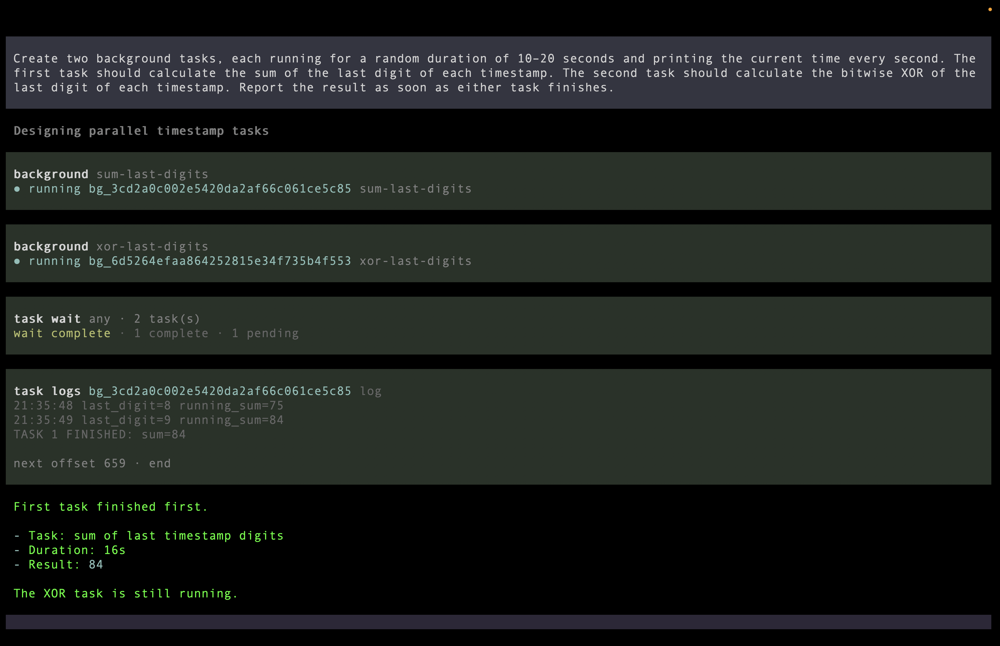
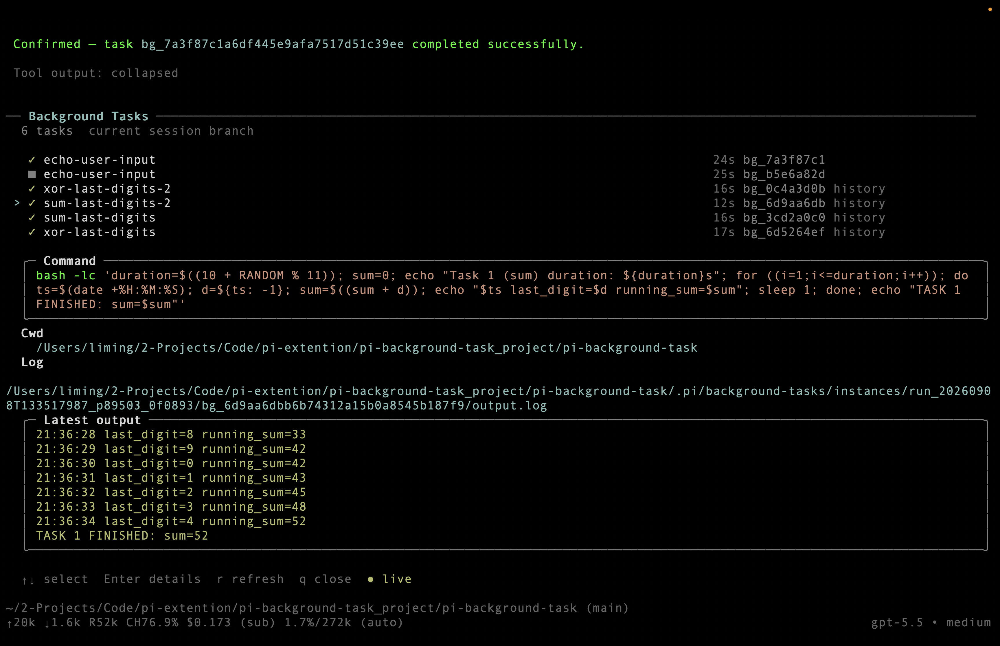

# pi-background-task

[English](README.md) · [简体中文](README.zh-CN.md)

为 [Pi coding agent](https://pi.dev/) 提供可靠、可交互的后台任务。`pi-background-task` 向 Pi 提供六个职责明确的工具，用来启动耗时命令、读取有限日志、发送终端输入、在不轮询模型的情况下等待，以及终止任务。每个任务都运行在真实的 tmux PTY 中，具有持久日志和完成唤醒能力，因此 Pi 可以一边继续推理，一边让工作在后台运行。

扩展刻意保持轻量、干净且容易审查：TypeScript 模块职责单一；运行时除 Pi peer packages 外只使用 Node.js 标准库；用户命令不会被拼接进 tmux 控制命令。后台任务的可见性与 Pi session tree 对应，因此 `/resume`、`/fork`、`/new` 和分支切换不会混入无关任务历史，也不会无故停止仍在运行的任务。

## 为什么选择它？

- **真正非阻塞**：构建、测试、服务、训练和数据处理可以脱离当前 Agent 轮次持续运行。
- **真实交互终端**：支持向 Shell、REPL、调试器和 TUI 发送文字、Enter、方向键、Escape 与控制键；需要人工接管时可直接 attach。
- **不让 LLM 轮询**：`task_wait` 在一次工具调用内等待；普通任务仅在完成时按需唤醒 Pi。
- **完整且持久的输出**：tmux `pipe-pane` 捕获完整 PTY 流；按字节 offset 分页，避免大日志灌入模型上下文。
- **理解 Pi session tree**：当前分支决定任务可见性；resume 能回到原分支记录，兄弟分支互不干扰。
- **明确的生命周期**：reload、resume、fork 与 new 不会杀死任务；只有真正退出 Pi 才取消当前 runtime 拥有的任务。
- **运行时轻量**：除 Pi peer packages 与系统 `tmux` 外，不引入第三方运行时依赖。
- **紧凑实时 TUI**：`/bg-tasks` 自动更新状态与运行时间，按需展开带语法高亮的命令与输出。

## 实际效果

Pi 可以组合使用 `task_start`、`task_wait` 与 `task_logs` 协调多个任务，同时保持工具结果简洁：



## 环境要求

- Pi `0.85.1` 或更高版本
- Node.js `20` 或更高版本
- macOS 或 Linux；Windows 请在 WSL 中运行 Pi
- `PATH` 中可以调用 `tmux`

## 安装

```bash
pi install npm:pi-background-task
```

## Agent 工具

扩展向 Pi 提供六个工具：

| 工具 | 用途 |
| --- | --- |
| `task_start` | 启动命令并立即返回 task ID |
| `task_status` | 查询状态、运行时间与退出码 |
| `task_logs` | 按字节 offset 读取有限日志，或截取当前屏幕 |
| `task_send` | 发送 literal text、Enter 或白名单控制键 |
| `task_wait` | 等待任一或全部任务，不轮询模型 |
| `task_kill` | 请求优雅取消或强制终止 |

`task_start` 参数示例：

```json
{
  "command": "python -u train.py",
  "name": "Training",
  "cwd": "./experiment",
  "timeoutSeconds": 3600,
  "notifyOnCompletion": true
}
```

下一次日志读取使用返回的 `nextOffset`。单次读取硬上限为 64 KiB，因此单个高噪声进程不会淹没模型上下文。

## 用户命令

- `/bg-tasks` 打开当前根节点到叶节点的 Pi session branch 所引用的任务；`/bg-tasks all` 包含项目历史。
- `/bg-attach <taskId>` 显示精确的 tmux attach 命令，不会自动替换 Pi 当前终端。
- `/bg-clear` 确认后删除当前 branch 可见的已结束记录，包括 resume 后恢复的历史。

面板中使用 `↑/↓` 选择、`Enter` 展开、`r` 强制刷新、`q` 或 `Esc` 关闭。正常更新由事件驱动；运行时间和展开的日志末尾每秒更新一次，不会调用模型。



## 体验用例

### 创建两个并行后台任务

```text
Create two background tasks, each running for a random duration of 10–20 seconds and printing the current time every second. The first task should calculate the sum of the last digit of each timestamp. The second task should calculate the bitwise XOR of the last digit of each timestamp.
```

### 创建任务并等待全部完成

```text
Create two background tasks, each running for a random duration of 10–20 seconds and printing the current time every second. The first task should calculate the sum of the last digit of each timestamp. The second task should calculate the bitwise XOR of the last digit of each timestamp. Report the result until all tasks finish.
```

### 与等待输入的任务交互

```text
Create a background task that waits for user input and then prints the input.
```

任务等待时，可以发送输入：

```text
Input: Ming
```

或者终止它：

```text
Kill this background task.
```

## 实现原理

```text
Pi Extension（tools、commands、renderers）
                  │
                  ▼
TaskRegistry（状态、分支范围、等待、通知）
            │                         │
            ▼                         ▼
TaskStore（原子文件）          TmuxBackend（PTY 控制）
                                          │
                                          ▼
                                      独立 Runner
```

任务启动包含一个很小但重要的握手：Registry 创建私有元数据与空日志；tmux 启动 Runner；Runner 停在单向启动门前，Backend 先配置 `pipe-pane`；随后 Registry 打开门，Runner 从元数据读取命令并通过用户 Shell 执行。结束时 Runner 原子写入 `result.json`，文件 watcher 与低频一致性扫描让 Pi 收敛到最终状态。

这个启动门只为防止极快命令的开头输出在日志管道就绪前丢失，并不存在第二套 readiness 协议。用户命令不会被拼接到 tmux 控制命令中。

工具结果也刻意分为两层：精简的 `content.text` 只向模型提供下一步决策需要的内容；结构化 `details` 则保存渲染和 session branch 重建信息，不重复注入上下文。

完整状态机、持久化格式、session tree 可见性、退出行为和故障边界见[架构设计](docs/architecture.zh-CN.md)。仓库同时包含可编辑的 [draw.io 源文件](docs/assets/architecture.drawio)。

## 数据与安全

```text
.pi/background-tasks/instances/<runtimeId>/<taskId>/
├── meta.json
├── output.log
└── result.json
```

runtime ID、tmux socket 与内部 session name 用于所有权和隔离；日常使用只需要任务名与 `bg_...` task ID。请勿把 `.pi/background-tasks/` 提交到版本控制。

命令以 Pi 的操作系统权限运行。本扩展是执行协调器，不是沙箱。避免把密钥放在命令参数或日志中。

## License

[MIT](LICENSE)
