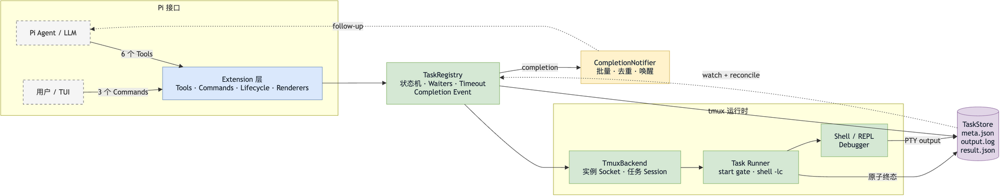

# Pi Background Task Extension Architecture

[English](architecture.md) · [简体中文](architecture.zh-CN.md)

## 1. Goals and boundaries

This extension presents tmux's persistent terminal capabilities as a background-task runtime for Pi. Version 0.1 covers starting, observing, interacting with, waiting for, notifying about, cancelling, and querying durable task history.

It intentionally does not take over tasks from another Pi runtime, reconnect after an abnormal Pi crash, recover across an operating-system reboot, execute remotely, or sandbox commands.



Editable source: [architecture.drawio](assets/architecture.drawio).

## 2. Components

| Component | Responsibility |
| --- | --- |
| Extension | Registers Pi lifecycle hooks, agent tools, user commands, and renderers |
| TaskRegistry | Owns the state machine, branch visibility, waits, timeouts, completion events, and recovery |
| TaskStore | Provides atomic JSON, private permissions, history discovery, and log paths |
| TmuxBackend | Controls sockets/sessions, literal input, allow-listed keys, screen capture, and attach commands |
| Runner | Reads metadata inside the pane, executes the shell command, and records a final result |
| CompletionNotifier | Batches completion events, deduplicates them durably, and sends Pi follow-ups |

Dependencies point one way: the Extension uses TaskRegistry; TaskRegistry composes TaskStore and TmuxBackend; Runner communicates only through a task directory. A tmux pane never depends on Pi's in-process objects.

## 3. Start handshake and data flow

Attaching `pipe-pane` after a command starts can lose its earliest output. A one-way start gate closes that race:

1. TaskRegistry atomically creates the task directory, `meta.json`, and an empty log.
2. TmuxBackend creates a task session on the runtime's private socket; the pane starts only Runner.
3. Runner waits for `start.signal` and has not yet executed the user command.
4. TmuxBackend attaches `pipe-pane`, appending the complete PTY stream to `output.log`.
5. TaskRegistry writes `start.signal`; Runner invokes `$SHELL -lc` with the command read from metadata.
6. TaskRegistry marks the metadata as `running` and returns to Pi.
7. Runner writes a temporary result and atomically renames it to `result.json` on exit.

The start signal is the only coordination file. A separate `runner.ready` protocol is unnecessary: tmux reports successful pane creation, and the gate prevents command execution until capture is configured.

All tmux operations use argument arrays and controlled identifiers. User commands are never concatenated into tmux control shell syntax. Literal text uses `send-keys -l`; special input is mapped from a fixed allow-list.

## 4. State model

```text
starting ──started─────> running ──exit 0────────> completed
    │                      ├───────exit != 0─────> failed
    │                      ├───────task_kill─────> cancelled
    │                      ├───────deadline──────> timed_out
    └────start failure────> failed

running ──session disappears without result─────> interrupted
unowned historical non-terminal record──────────> unknown (read-only view)
```

`result.json` is authoritative and is never overwritten once present. Cancellation intent is atomically recorded before a signal is sent, so a process that catches Ctrl+C and exits with code 0 still resolves to `cancelled` or `timed_out`.

## 5. Persistence

```text
.pi/background-tasks/
└── instances/
    └── <runtimeId>/
        └── <taskId>/
            ├── meta.json
            ├── output.log
            ├── result.json       # appears at termination
            ├── start.signal      # one-way gate opened after pipe-pane
            └── cancel.json       # appears for cancellation or timeout
```

- Directories use mode `0700`; data files use `0600`.
- JSON records carry `schemaVersion: 1` and use same-directory temporary files plus atomic rename.
- Task IDs are `bg_` followed by 32 lowercase hexadecimal UUID digits. IDs are validated before path construction.
- Log offsets are raw byte positions. ANSI removal affects display, never pagination.

## 6. Runtime ownership and session-tree visibility

A process-global runtime ID survives extension reloads and Pi session transitions within the same process. It has a readable `run_<UTC>_p<PID>_<suffix>` format. One private tmux socket belongs to that runtime, and every task gets its own tmux session.

Task references are persisted in structured `task_start` tool-result details. TaskRegistry scans `sessionManager.getBranch()` and, by default, shows only references on the current root-to-active-leaf path. `/tree` therefore hides sibling-branch tasks naturally. Forking copies a reference, not a background process.

Visibility, liveness, and control are separate concepts:

- The Pi session tree determines default visibility.
- Changing branch or session does not stop a task.
- Runtime ownership determines whether the extension may attach, send input, wait, or terminate.

Historical records from another runtime can be read explicitly, through an inherited branch reference, or with `/bg-tasks all`. A non-terminal unowned record is projected as `unknown`; the new runtime does not probe its live screen or take control. `/bg-clear` may delete visible terminal history because record cleanup is not process control.

`session_start` creates only the common storage root. A runtime directory appears on the first task start, so `/resume`, `/new`, and `pi -r` do not create empty instance folders.

## 7. Waits and completion notification

TaskRegistry watches result files and runs a one-second reconciliation pass. Both are local extension work and never invoke the model.

`task_wait` registers an in-memory waiter:

- `all` resolves after every requested task is terminal.
- `any` resolves after one task is terminal and returns the remaining IDs.
- A wait timeout returns `timedOut: true` without terminating tasks.
- An AbortSignal cancels only the wait.

When `task_wait` covers a completion, its tool result delivers the event. Otherwise CompletionNotifier batches completions for 150 ms and sends a `followUp + triggerTurn` message. A durable `notifiedAt` marker prevents duplicate wake-ups after reload.

Tool results have two deliberate layers. `details` retains full structured state for rendering and branch reconstruction. `content.text` contains only the task ID, state, exit code, and bounded output needed for the model's next decision—not cwd, owner, socket, internal session name, or duplicated metadata.

## 8. Pi lifecycle

| `session_shutdown.reason` | Behavior |
| --- | --- |
| `reload`, `new`, `resume`, `fork` | Release watchers, timers, and UI references; keep tmux jobs alive; rebuild visible branch state on the next start |
| `/tree` | Keep TaskRegistry and jobs alive; recompute branch visibility and pending completion delivery |
| `quit` | Record cancellation for owned running tasks, send Ctrl+C, wait 1.5 seconds, then close remaining task sessions |

After an abnormal Pi crash, tmux and Runner may finish a task and write its result. A future Pi runtime receives a new owner ID and deliberately does not take control of the survivor.

## 9. TUI rules

The task panel is compact and uses Pi semantic theme colors. Status uses both symbols and text. Command and Latest output use bordered code regions; commands are highlighted as Bash. Cwd and Log are structured semantic values. Backend identifiers are excluded from the normal interface.

Every rendered line is measured with ANSI-aware visible width and wrapped or truncated to the actual terminal width. The panel subscribes to TaskRegistry `changed` events. A local one-second redraw updates elapsed time; only an expanded detail reads up to 4 KiB from the log tail. Closing the panel removes subscriptions and timers. Non-TUI modes return a persisted text summary instead of creating terminal components.

## 10. Failure and security semantics

- Missing tmux or native Windows produces an explicit startup error.
- Runner exits if the start gate is not opened within ten seconds; reconciliation converges the task state.
- An owned tmux session disappearing without a result becomes `interrupted`.
- Log reads default to 16 KiB and cap at 64 KiB; screen capture caps at 500 lines.
- Commands execute with Pi's system permissions. The extension does not claim to sandbox them.
- Cleanup targets exact runtime/task sessions and never calls global `tmux kill-server`.
